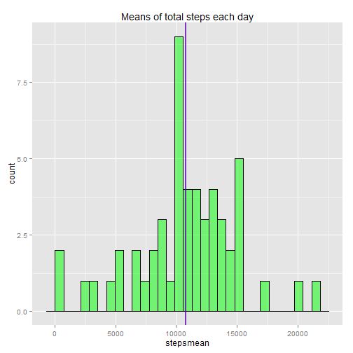
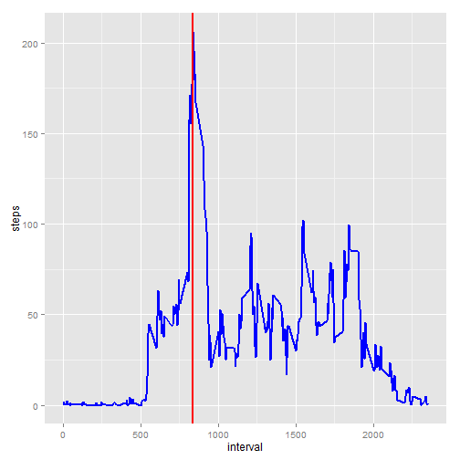
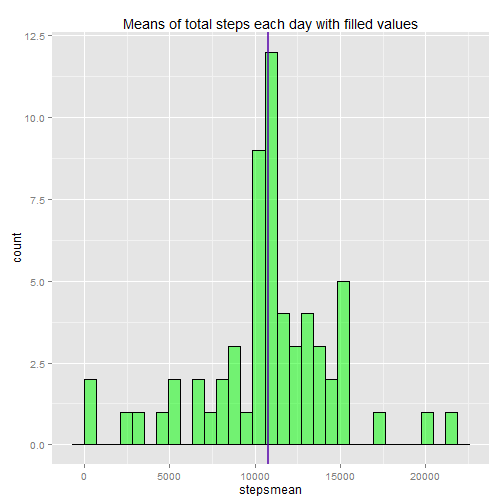
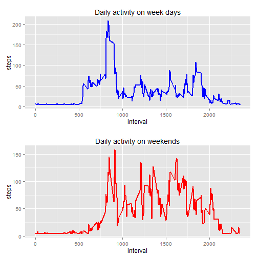

# Reproducible Research: Peer Assessment 1
This is assignment-1 for the coursera course "Reproducible Research". Here we are given the data from a persnoal activity monitoring device. The device collects data in 5 mins intervals throughout the day. This data is for 2 months october and november. The data is available [here](https://d396qusza40orc.cloudfront.net/repdata%2Fdata%2Factivity.zip).

Lets first load the data into a data frame and have a look whats inside.

## Loading and preprocessing the data
Lets first load the data into a data frame and have a look whats inside.

```r
data1<-read.csv("./activity/activity.csv")
dim(data1)
```

```
## [1] 17568     3
```

```r
names(data1)
```

```
## [1] "steps"    "date"     "interval"
```

```r
str(data1)
```

```
## 'data.frame':	17568 obs. of  3 variables:
##  $ steps   : int  NA NA NA NA NA NA NA NA NA NA ...
##  $ date    : Factor w/ 61 levels "2012-10-01","2012-10-02",..: 1 1 1 1 1 1 1 1 1 1 ...
##  $ interval: int  0 5 10 15 20 25 30 35 40 45 ...
```

As we saw above outputs, there are three columns named steps,date and interval. The steps column is integer, date is factor and interval is integer. Also note that some of the values in steps are 'NA'.We will take care of those later in this document.

Now lets process the data for NA values. We will only take the rows where there is complete cases that is having no unavailable data(or NAs).

```r
data<-data1[complete.cases(data1),]
dim(data)
```

```
## [1] 15264     3
```


## What is mean total number of steps taken per day?
Now after the loading and preprocessing of the data, lets move on to some analysis. We will see the mean of total number of steps taken per day.

```r
library(plyr)
library(ggplot2)
meansteps<-ddply(data,.(date),summarise,stepsmean=sum(steps))
dim(meansteps)
```

```
## [1] 53  2
```

```r
names(meansteps)
```

```
## [1] "date"      "stepsmean"
```

```r
head(meansteps,5)
```

```
##         date stepsmean
## 1 2012-10-02       126
## 2 2012-10-03     11352
## 3 2012-10-04     12116
## 4 2012-10-05     13294
## 5 2012-10-06     15420
```

```r
#ggplot(meansteps,aes(x=date,y=stepsmean,alpha=1/2))+geom_bar(stat="identity")
mean = mean(meansteps$stepsmean)
median = median(meansteps$stepsmean)
#ggplot(meansteps,aes(x=date,y=stepsmean))+geom_point(alpha=1/2,size=5) + geom_abline(intercept=mean,colour="red") + geom_abline(intercept=median,colour="blue") + scale_colour_manual(values=c(mean="red",median="blue"))
ggplot(meansteps,aes(x=stepsmean)) + geom_histogram(colour="black",fill="green",alpha=1/2) + geom_vline(xintercept=mean,colour="red",size=1,alpha=1/2) + geom_vline(xintercept=median,colour="blue",size=1,alpha=1/2) + labs(title="Means of total steps each day")
```

```
## stat_bin: binwidth defaulted to range/30. Use 'binwidth = x' to adjust this.
```

 

In the above, histogram shows the frequency distribution for total steps taken per day. The vertical red line shows the mean and the vertical blue line shows the median. As the mean and median are very close, we are not able to distinguish.Below is the mean and median of the total steps taken each day.

```r
mean
```

```
## [1] 10766
```

```r
median
```

```
## [1] 10765
```


## What is the average daily activity pattern?
Now lets look for the daily activity pattern.

```r
dailypattern<-ddply(data,.(interval),summarise,steps=mean(steps))
max<-dailypattern[dailypattern$steps == max(dailypattern$steps),1]
ggplot(dailypattern,aes(interval,steps)) + geom_line(colour="blue",size=1) + geom_vline(xintercept=max,size=1,colour="red")
```

 

Now lets see which 5 min interval has hieghest activity


```r
max
```

```
## [1] 835
```

Time of day

```r
hrs<-floor(max/60)
mins<-((max/60)-hrs)*60
print("Hours: ")
```

```
## [1] "Hours: "
```

```r
print(hrs)
```

```
## [1] 13
```

```r
print("minutes :")
```

```
## [1] "minutes :"
```

```r
print(mins)
```

```
## [1] 55
```
## Imputing missing values
With a little bit of inspection we can see that the missing values i.e NAs are there for the whole day for some of the days. So in this case , we can find out the days which have missing value data by following code.

```r
missingDates<-data[table(data$date) == 0,2]
```
We can fill these values with average number of steps of the average total steps mean. Average of total steps taken per day is 

```
## [1] 10766
```
and we can devide it by 288 to get the filling value.

```r
fillvalue<-mean/(24*60/5)
fillvalue
```

```
## [1] 37.38
```

Now lets fill the missing values

```r
data1[is.na(data1$steps),1] <- fillvalue
head(data1,5)
```

```
##   steps       date interval
## 1 37.38 2012-10-01        0
## 2 37.38 2012-10-01        5
## 3 37.38 2012-10-01       10
## 4 37.38 2012-10-01       15
## 5 37.38 2012-10-01       20
```

Lets calculate the mean and median for new data frame with filled missing values.


```r
new_meansteps<-ddply(data1,.(date),summarise,stepsmean=sum(steps))
dim(new_meansteps)
```

```
## [1] 61  2
```

```r
names(new_meansteps)
```

```
## [1] "date"      "stepsmean"
```

```r
head(new_meansteps,5)
```

```
##         date stepsmean
## 1 2012-10-01     10766
## 2 2012-10-02       126
## 3 2012-10-03     11352
## 4 2012-10-04     12116
## 5 2012-10-05     13294
```

```r
new_mean = mean(new_meansteps$stepsmean)
new_median = median(new_meansteps$stepsmean)
ggplot(new_meansteps,aes(x=stepsmean)) + geom_histogram(colour="black",fill="green",alpha=1/2) + geom_vline(xintercept=new_mean,colour="red",size=1,alpha=1/2) + geom_vline(xintercept=new_median,colour="blue",size=1,alpha=1/2) + labs(title="Means of total steps each day with filled values")
```

```
## stat_bin: binwidth defaulted to range/30. Use 'binwidth = x' to adjust this.
```

 

Following are the mean and median comparision

```r
mean
```

```
## [1] 10766
```

```r
new_mean
```

```
## [1] 10766
```

```r
median
```

```
## [1] 10765
```

```r
new_median
```

```
## [1] 10766
```

## Are there differences in activity patterns between weekdays and weekends?
Lets process the data frame now to add a new column named days which is a factor variable of "weekday" and "weekend".

```r
library(gridExtra)
data1<-data.frame(data1,days=weekdays(strptime(data1$date,"%Y-%m-%d")))
names(data1)
```

```
## [1] "steps"    "date"     "interval" "days"
```

```r
data1[,4] <- weekdays(strptime(data1$date,"%Y-%m-%d"))
data1[data1$days %in% c("Monday","Tuesday","Wednesday","Thursday","Friday"),4] <- "weekday"
data1[data1$days %in% c("Saturday","Sunday"),4] <- "weekend"
table(data1$days)
```

```
## 
## weekday weekend 
##   12960    4608
```

```r
dailypattern_weekday<-ddply(subset(data1,data1$days == "weekday"),.(interval),summarise,steps=mean(steps))
dailypattern_weekend<-ddply(subset(data1,data1$days == "weekend"),.(interval),summarise,steps=mean(steps))
plot1<-ggplot(dailypattern_weekday,aes(interval,steps)) + geom_line(colour="blue",size=1) + labs(title="Daily activity on week days")
plot2<-ggplot(dailypattern_weekend,aes(interval,steps)) + geom_line(colour="red",size=1) + labs(title="Daily activity on weekends")
grid.arrange(plot1,plot2,nrow=2)
```

 

**So as we see from the above plots that there no significant change in daily activity on weekdays and weekends.**
